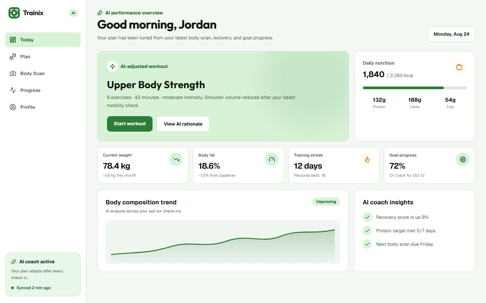
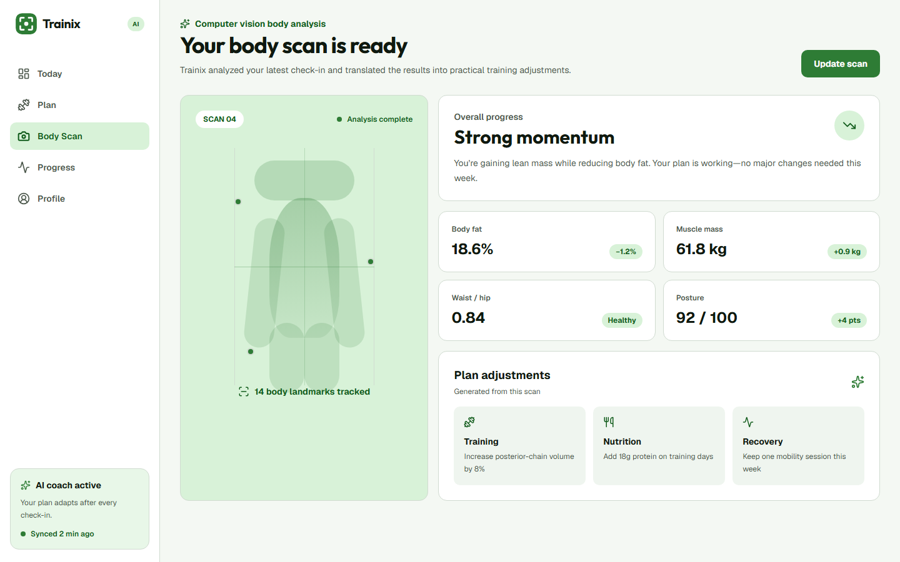
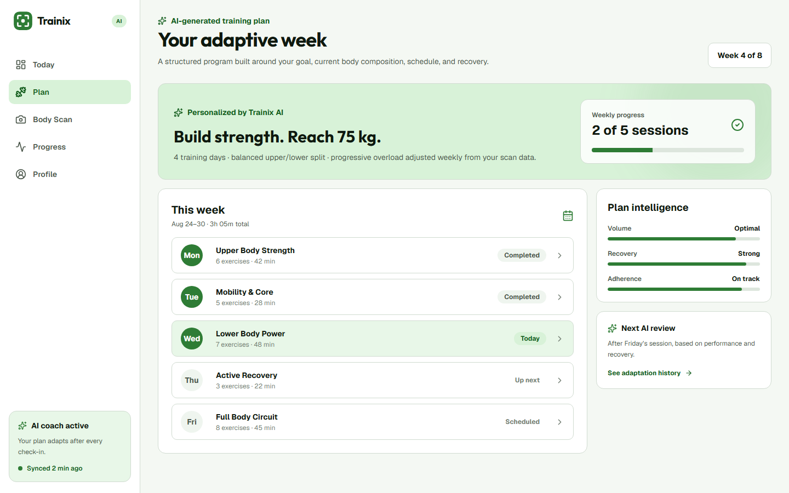

# Trainix — AI Fitness & Nutrition Platform

Trainix turns a body check-in into an adaptive fitness experience. The platform combines computer-vision body analysis, personalized workout and nutrition generation, progress tracking, and day-to-day coaching in one product.

[Live demo](https://trainix-beta.vercel.app/) · Full-stack case study

## Product experience

| AI coaching dashboard | Computer-vision body analysis |
| --- | --- |
|  |  |



## Core capabilities

- AI-assisted body analysis from a photo check-in
- Adaptive 28-day workout generation based on body metrics, goal, and fitness level
- Personalized nutrition plans with calories and macro targets
- Progress reporting across weight, body composition, adherence, and streaks
- Secure JWT authentication with session refresh and protected app routes
- Photo storage through AWS S3 and CloudFront
- Resilient frontend state with Redux Toolkit and TanStack Query
- Full-stack QA covering types, unit tests, API tests, and Playwright flows

## Architecture

- **Frontend:** Next.js 16, React 19, TypeScript, Tailwind CSS, Redux Toolkit, TanStack Query
- **Core API:** Express.js, MongoDB, JWT authentication, Socket.IO
- **AI service:** Python API for photo analysis and plan generation
- **Infrastructure:** AWS S3/CloudFront, Docker, Render, Vercel
- **Quality:** Jest, Supertest, Playwright, TypeScript

## Local development

```bash
npm --prefix frontend install
npm --prefix backend install
npm --prefix frontend run dev
npm --prefix backend run dev
```

Copy `.env.example` into the relevant service and provide the documented database, authentication, storage, and AI service values before starting the full stack.

## Quality checks

```bash
npm run qa:types
npm run qa:frontend
npm run qa:api
npm run qa:e2e:smoke
```

The repository is licensed under the [GNU GPL v3](LICENSE).
